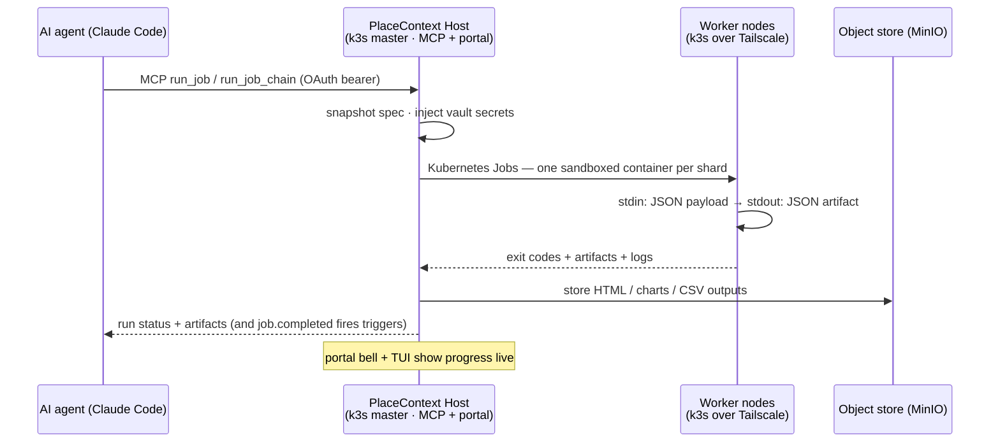
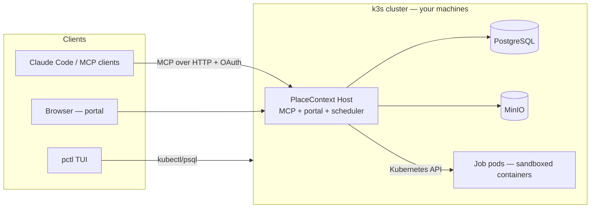

# PlaceContext

**A context platform for AI.** Built by Bradley Lietz.

PlaceContext gives AI agents and the people working with them a durable, structured home for
project context — decisions, activity, **jobs and their artifacts**, data, and
analytics — served over [MCP](https://modelcontextprotocol.io) and a web portal. Connect Claude
Code (or any MCP client) to one endpoint and your agent can remember decisions across sessions,
queue work, and **run real containerized jobs on your own machines** — from a laptop to a
multi-node fleet.

```bash
# Install the placecontext CLI, then open the TUI
curl -fsSL https://get.placecontext.ai/install.sh | bash
placecontext               # install / upgrade / connect a cluster
# after cluster install → portal http://localhost:7700   ·   MCP /mcp
```

Then connect your agent:

```bash
claude mcp add --transport http placecontext http://localhost:7700/mcp
```

The first tool call opens a browser to sign in (OAuth 2.1 + PKCE, tenant-scoped tokens with
automatic refresh). No API keys to paste.

## What your agent gets

- **Durable memory** — `get_project_overview` at session start, `record_activity` and `add_decision`
  as it works. Nothing lives only in a chat scrollback.
- **A job runner** — upload code (`python`, `node`, `go`, `ruby`, `dotnet`) or point at a container
  image; PlaceContext fans out shards as sandboxed containers (no network egress by default),
  collects JSON artifacts, and stores HTML/chart/CSV outputs in the object store.
- **Job chains** — `run_job_chain` pipes each job's output into the next job's input: a
  multi-step pipeline in one MCP call.
- **Schedules & events** — cron triggers and event triggers (`job.completed`, or your own event
  types via `emit_event`) run jobs while the agent is offline.
- **Per-project data & analytics** — every project gets its own SQL tables; deterministic
  renderers turn run output into reports and charts.
- **On-demand runs with parameters** — declare job parameters and the portal prompts for them in a
  form; agents pass them as the input payload.

## How a job runs across your fleet

An agent anywhere talks MCP to the master; work executes on whichever node has capacity —
including machines behind different NATs, joined over [Tailscale](https://tailscale.com):



The same queue serves the portal's Run button, cron/event triggers, and the TUI — runs are durable
rows claimed with `FOR UPDATE SKIP LOCKED`, so any replica can execute them and nothing is lost on
restart.

## The fleet

Everything deploys with **`pctl`** (bash) and its full-screen **TUI dashboard** (Go/Bubble Tea):

- **Dev**: a real 1-server + 2-agent [k3s](https://k3s.io) cluster via [k3d](https://k3d.io) on one
  machine — `./deploy/pctl dev up`.
- **Production**: genuine multi-machine k3s. `sudo ./deploy/pctl server up` on the master prints a
  join code; run it on any Linux box — nodes connect over **Tailscale** (or self-hosted
  [Headscale](https://headscale.net)), so a fleet can span homes, offices, and clouds with zero
  port-forwarding. A **Mac laptop master** (k3d) can also mint join codes for remote Linux workers
  when the API is published on `:6443` (default for new installs).
- **Air-gap friendly**: images ship as tarballs inside cross-arch packages (`pctl package`) — no
  registry pulls on the nodes.
- **Jobs run on your machines**: job pods prefer worker nodes, so a small cloud master (e.g. a
  DigitalOcean droplet) serves the portal while execution lands on the workers you joined.
  `pctl jobs placement require` makes that a hard rule — the portal server never runs jobs.
- Postgres and MinIO run in-cluster; the portal, MCP endpoint, and job scheduler are one
  process, scaled horizontally.

See [`deploy/README.md`](deploy/README.md) for the full pctl reference.

## Architecture

Onion architecture, DDD, tests-first, with a hand-rolled CQRS dispatcher — dependencies point
inward only (enforced by `PlaceContext.Architecture.Tests`):

```
src/
  PlaceContext.Domain          → entities/aggregates (Job, JobRun, JobChain, Project, …), no I/O
  PlaceContext.Application     → command/query handlers, ports, the dispatcher, views
  PlaceContext.Infrastructure  → EF Core/PostgreSQL, Kubernetes runner, MinIO, schedulers
  PlaceContext.Host            → MCP tools (Streamable HTTP) + Blazor portal (composition root)
deploy/
  pctl · tui/ · k3s/           → cluster lifecycle CLI, Go TUI, Kubernetes manifests
```



## Developing

```bash
dotnet build && dotnet test        # all suites green; architecture tests enforce the onion
dotnet run --project src/PlaceContext.Host   # portal http://localhost:7700, MCP at /mcp
make -C deploy/tui                 # build the TUI binary
```

You'll need the .NET 10 SDK, Go (for the TUI), and a PostgreSQL (the dev cluster provides one, or:
`docker run -d -e POSTGRES_PASSWORD=postgres -e POSTGRES_DB=placecontext -p 5433:5432 postgres:16`).
EF migrations apply automatically on startup.

## Upgrading

- From a git checkout: `./deploy/pctl update --deploy` (pulls, rebuilds, rolls the cluster).
- From a packaged install: download the latest release package and re-run `./install.sh` — it
  detects the existing cluster and rolls the new image in.

## License

**Software:** proprietary — © Bradley Lietz / CTRL SIGNAL SOFTWARE PTY LTD. See [LICENSE](LICENSE).

**Your data and jobs:** owned by you. PlaceContext does not claim ownership of project data,
knowledge, job definitions, runs, or artifacts you create or import. Details are in [LICENSE](LICENSE).

Third-party components used by PlaceContext are listed in
[THIRD-PARTY-NOTICES.md](THIRD-PARTY-NOTICES.md).
