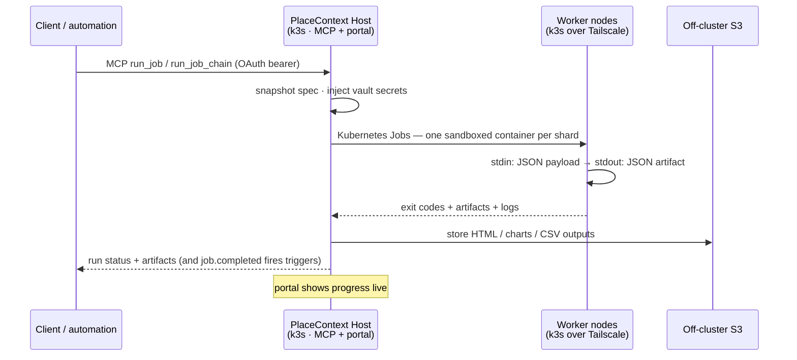
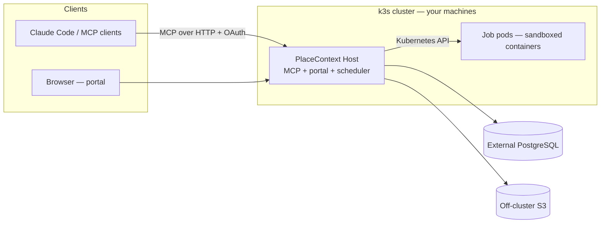

<p align="center">
  
</p>

<h1 align="center">PlaceContext</h1>

<p align="center">
  <strong>Turn code and containers into durable jobs that run anywhere you own.</strong>
</p>

<p align="center">
  <a href="https://github.com/bradlnz/placecontext/releases/latest"></a>
  <a href="https://github.com/bradlnz/placecontext/actions/workflows/release.yml"></a>
  <a href="LICENSE"></a>
  
</p>

PlaceContext is an open-source, self-hosted job engine with a web portal and an MCP endpoint. Run work on
demand, on schedules, or from events; fan it out across your fleet; connect jobs into pipelines; and keep the
resulting data, logs, traces, and artifacts under your control.

## Quick start

```bash
# Download the verified release and create a local k3d cluster plus local AI
curl -fsSL https://get.placecontext.io/install.sh | bash
# portal http://localhost:7700 · MCP /mcp
```

Requires Linux or macOS with `curl`; the installer provisions the remaining local runtime dependencies.

### Connect automation and AI clients

MCP is one interface to the job engine—not the product boundary. Claude Code and other MCP clients can query
project data and context, submit jobs and pipelines, record decisions, and retrieve outputs through the same
permission model as the portal:

```bash
claude mcp add --transport http placecontext http://localhost:7700/mcp
```

The first tool call opens a browser to sign in (OAuth 2.1 + PKCE, tenant-scoped tokens with
automatic refresh). No API keys to paste.

## Why PlaceContext

- **Project databases and entity models** — create project-scoped SQL tables, define linked entities, browse
  records, map job outputs into tables, and explore relationships without mixing tenant data.
- **Containerised compute** — upload code (`python`, `node`, `go`, `ruby`, `dotnet`) or use a container image;
  PlaceContext fans out sandboxed shards across your fleet, collects results and logs, and persists outputs.
- **Pipelines and automation** — chain jobs into multi-step flows, declare run parameters, and trigger work on
  demand, on schedules, or from events while operators are offline.
- **Analytics and artifacts** — query project data, create charts and reports, and retain HTML, chart, CSV, and
  structured run artifacts in object storage.
- **Lineage and observability** — inspect job-to-table mappings, run and chain history, shard outcomes, logs,
  OpenTelemetry traces, and operational status across the workspace.
- **Governed access** — project and tenant boundaries, role-based permissions, OAuth 2.1 + PKCE, encrypted
  secrets, and sandboxed jobs with network egress disabled by default.
- **MCP and automation integration** — durable project context and MCP tools let AI and automation clients use
  the same governed data, jobs, pipelines, and artifacts as human operators.

## How a job runs across your fleet

Any authenticated client can submit work through the portal or MCP endpoint; execution lands on whichever node
has capacity—including machines behind different NATs, joined over [Tailscale](https://tailscale.com):



The same queue serves the portal's Run button, cron/event triggers, and MCP clients — runs are durable
rows claimed with `FOR UPDATE SKIP LOCKED`, so any replica can execute them and nothing is lost on
restart.

## The fleet

The local installer creates a lab [k3s](https://k3s.io) cluster through [k3d](https://k3d.io).
Production deploys to an existing HA k3s cluster and keeps PostgreSQL, S3, and backups off-cluster.
From the portal's Cluster tab, each additional node has an explicit role:

- **Standard worker** runs regular PlaceContext jobs and workload shards.
- **AI shard** joins the fleet and runs one ordered MLX/Torch model layer slice.

The generated command handles the k3s join and, for an AI shard, downloads the same verified GitHub
release and installs the worker service. The portal, MCP endpoint, and scheduler share one Host process.

See [`deploy/release/README.md`](deploy/release/README.md) for installer and shard options.

## Architecture

Onion architecture, DDD, tests-first, with a hand-rolled CQRS dispatcher — dependencies point
inward only (enforced by `PlaceContext.Architecture.Tests`):

```
src/
  PlaceContext.Domain          → entities/aggregates (Job, JobRun, JobChain, Project, …), no I/O
  PlaceContext.Application     → command/query handlers, ports, the dispatcher, views
  PlaceContext.Infrastructure  → EF Core/PostgreSQL, Kubernetes runner, S3, schedulers
  PlaceContext.Host            → MCP tools (Streamable HTTP) + Blazor portal (composition root)
                                 Razor views are MVVM-only: scoped ViewModels own state,
                                 commands, validation, navigation, service access, and JS interop
deploy/
  release/                    → release installer, k3s manifests, local-AI runtime
```



## Developing

```bash
./setup.sh                          # install source-development prerequisites
./run.sh                            # database, build, migrations, app
./run.sh --fresh                    # destructive: recreate the local database, then start
./start.sh                          # later runs: build and start the prepared app
./start.sh --no-build --port 7710   # fast restart on a different port
dotnet build && dotnet test        # all suites green; architecture tests enforce the onion
dotnet run --project src/PlaceContext.Host   # portal http://localhost:7700, MCP at /mcp
```

On a database without a human owner account, opening the portal redirects to the first-run setup.
That flow creates the default workspace owner and signs them in; no shared default password is used.

You'll need the .NET 10 SDK and PostgreSQL (the release cluster provides one, or:
`docker run -d -e POSTGRES_PASSWORD=postgres -e POSTGRES_DB=placecontext -p 5433:5432 postgres:16`).
EF migrations apply automatically on startup.

## Documentation

- [Installation and fleet setup](deploy/release/README.md)
- [OpenSearch integration](src/PlaceContext.Host/Wiki/opensearch-integration.md)
- [SSO and OAuth integration](src/PlaceContext.Host/Wiki/sso-and-oauth.md)
- [Security and sharing](src/PlaceContext.Host/Wiki/security-and-sharing.md)

The Markdown files under `src/PlaceContext.Host/Wiki/` are embedded into the portal and are the
operator-facing documentation shipped with each build.

## Upgrading

- Re-run the installer to download and verify the newest compiled GitHub release, then roll the deployment.
- Pass `--version v1.2.3` to install or retain a specific release.

## License

**Software:** open source under the MIT License — © Bradley Lietz / CTRL SIGNAL SOFTWARE PTY LTD. See [LICENSE](LICENSE).

**Your data and jobs:** owned by you. PlaceContext does not claim ownership of project data,
knowledge, job definitions, runs, or artifacts you create or import. Details are in [LICENSE](LICENSE).

Third-party components used by PlaceContext are listed in
[THIRD-PARTY-NOTICES.md](THIRD-PARTY-NOTICES.md).

## Contributing and security

Contributions are welcome. See [CONTRIBUTING.md](CONTRIBUTING.md) for the development workflow and
[CODE_OF_CONDUCT.md](CODE_OF_CONDUCT.md) for community expectations. Please report vulnerabilities
privately as described in [SECURITY.md](SECURITY.md).
