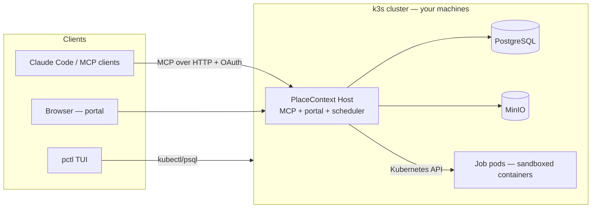

# PlaceContext

**A full-scale, self-hosted data platform.** Built by Bradley Lietz.

PlaceContext unifies operational data, compute, automation, analytics, and governance in one project-scoped
workspace. Create SQL tables and entity models, ingest and transform data with containerised jobs, orchestrate
multi-step pipelines, inspect lineage and execution traces, publish artifacts and charts, and activate records
through built-in CRM workflows. The web portal, CLI/TUI, schedules, events, and MCP endpoint all operate on the
same durable platform.

```bash
# Install the placecontext CLI, then open the TUI
curl -fsSL https://get.placecontext.ai/install.sh | bash
placecontext               # install / upgrade / connect a cluster
# after cluster install → portal http://localhost:7700   ·   MCP /mcp
```

### Connect automation and AI clients

MCP is one interface to the platform—not the product boundary. Claude Code and other MCP clients can query
project data and context, submit jobs and pipelines, record decisions, and retrieve outputs through the same
permission model as the portal:

```bash
claude mcp add --transport http placecontext http://localhost:7700/mcp
```

The first tool call opens a browser to sign in (OAuth 2.1 + PKCE, tenant-scoped tokens with
automatic refresh). No API keys to paste.

## Platform capabilities

- **Project databases and entity models** — create project-scoped SQL tables, define linked entities, browse
  records, map job outputs into tables, and explore relationships without mixing tenant data.
- **Containerised compute** — upload code (`python`, `node`, `go`, `ruby`, `dotnet`) or use a container image;
  PlaceContext fans out sandboxed shards across your fleet, collects results and logs, and persists outputs.
- **Pipelines and automation** — chain jobs into multi-step flows, declare run parameters, and trigger work on
  demand, on schedules, or from events while operators are offline.
- **Analytics and artifacts** — query project data, create charts and reports, and retain HTML, chart, CSV, and
  structured run artifacts in object storage.
- **Lineage and observability** — inspect job-to-table mappings, run and chain history, shard outcomes, logs,
  OpenTelemetry traces, and operational status across the workspace.
- **Operational CRM** — manage client records, lifecycle stages, communications, artifacts, and automations
  alongside the data and workloads that support them.
- **Governed access** — project and tenant boundaries, role-based permissions, OAuth 2.1 + PKCE, encrypted
  secrets, and sandboxed jobs with network egress disabled by default.
- **Agent and automation integration** — durable project context and MCP tools let AI and automation clients use
  the same governed data, jobs, pipelines, and artifacts as human operators.

## How a job runs across your fleet

Any authenticated client can submit work through the portal or MCP endpoint; execution lands on whichever node
has capacity—including machines behind different NATs, joined over [Tailscale](https://tailscale.com):

```mermaid
sequenceDiagram
    participant A as Client / automation
    participant M as PlaceContext Host<br/>(k3s master · MCP + portal)
    participant W as Worker nodes<br/>(k3s over Tailscale)
    participant S as Object store (MinIO)

    A->>M: MCP run_job / run_job_chain (OAuth bearer)
    M->>M: snapshot spec · inject vault secrets
    M->>W: Kubernetes Jobs — one sandboxed container per shard
    W->>W: stdin: JSON payload → stdout: JSON artifact
    W-->>M: exit codes + artifacts + logs
    M->>S: store HTML / charts / CSV outputs
    M-->>A: run status + artifacts (and job.completed fires triggers)
    Note over M: portal bell + TUI show progress live
```



The same queue serves the portal's Run button, cron/event triggers, and the TUI — runs are durable
rows claimed with `FOR UPDATE SKIP LOCKED`, so any replica can execute them and nothing is lost on
restart.

## The fleet

Everything deploys with **`pctl`** (bash) and its full-screen **TUI dashboard** (Go/Bubble Tea):

- **Dev**: a real 1-server + 2-agent [k3s](https://k3s.io) cluster via [k3d](https://k3d.io) on one
  machine — `./deploy/pctl dev up`.
- **Production**: genuine multi-machine k3s. `sudo ./deploy/pctl server up` on the master prints a
  join code; run it on any Linux box — nodes connect over **Tailscale** (or self-hosted
  [Headscale](https://headscale.net)), so a fleet can span homes, offices, and clouds with zero
  port-forwarding. A **Mac laptop master** (k3d) can also mint join codes for remote Linux workers
  when the API is published on `:6443` (default for new installs).
- **Air-gap friendly**: images ship as tarballs inside cross-arch packages (`pctl package`) — no
  registry pulls on the nodes.
- **Jobs run on your machines**: job pods prefer worker nodes, so a small cloud master (e.g. a
  DigitalOcean droplet) serves the portal while execution lands on the workers you joined.
  `pctl jobs placement require` makes that a hard rule — the portal server never runs jobs.
- Postgres and MinIO run in-cluster; the portal, MCP endpoint, and job scheduler are one
  process, scaled horizontally.

See [`deploy/README.md`](deploy/README.md) for the full pctl reference.

## Architecture

Onion architecture, DDD, tests-first, with a hand-rolled CQRS dispatcher — dependencies point
inward only (enforced by `PlaceContext.Architecture.Tests`):

```
src/
  PlaceContext.Domain          → entities/aggregates (Job, JobRun, JobChain, Project, …), no I/O
  PlaceContext.Application     → command/query handlers, ports, the dispatcher, views
  PlaceContext.Infrastructure  → EF Core/PostgreSQL, Kubernetes runner, MinIO, schedulers
  PlaceContext.Host            → MCP tools (Streamable HTTP) + Blazor portal (composition root)
                                 Razor views are MVVM-only: scoped ViewModels own state,
                                 commands, validation, navigation, service access, and JS interop
deploy/
  pctl · tui/ · k3s/           → cluster lifecycle CLI, Go TUI, Kubernetes manifests
```



## Developing

```bash
./run.sh                            # first run: prerequisites, database, build, migrations, app
./run.sh --fresh                    # destructive: recreate the local database, then start
./start.sh                          # later runs: build and start the prepared app
./start.sh --no-build --port 7710   # fast restart on a different port
dotnet build && dotnet test        # all suites green; architecture tests enforce the onion
dotnet run --project src/PlaceContext.Host   # portal http://localhost:7700, MCP at /mcp
make -C deploy/tui                 # build the TUI binary
```

On a database without a human owner account, opening the portal redirects to the first-run setup.
That flow creates the default workspace owner and signs them in; no shared default password is used.

You'll need the .NET 10 SDK, Go (for the TUI), and a PostgreSQL (the dev cluster provides one, or:
`docker run -d -e POSTGRES_PASSWORD=postgres -e POSTGRES_DB=placecontext -p 5433:5432 postgres:16`).
EF migrations apply automatically on startup.

## Upgrading

- From a git checkout: `./deploy/pctl update --deploy` (pulls, rebuilds, rolls the cluster).
- From a packaged install: download the latest release package and re-run `./install.sh` — it
  detects the existing cluster and rolls the new image in.

## License

**Software:** open source under the MIT License — © Bradley Lietz / CTRL SIGNAL SOFTWARE PTY LTD. See [LICENSE](LICENSE).

**Your data and jobs:** owned by you. PlaceContext does not claim ownership of project data,
knowledge, job definitions, runs, or artifacts you create or import. Details are in [LICENSE](LICENSE).

Third-party components used by PlaceContext are listed in
[THIRD-PARTY-NOTICES.md](THIRD-PARTY-NOTICES.md).
